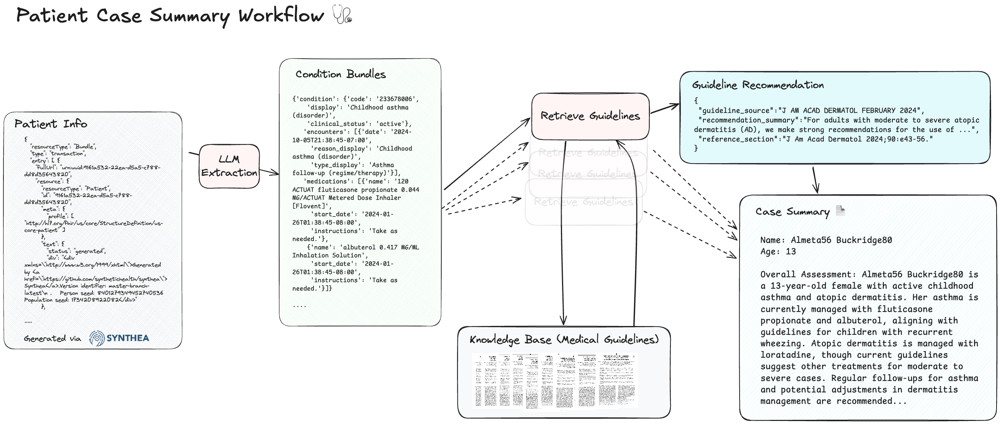

# Patientyoda

`Patientyoda` implements *Patient Case Summary Workflow* with **Spring AI**.
This project shows how to build an agentic workflow with multiple steps. 

[!NOTE]
> The image, workflow, prompt templates are courtesy LlamaIndex. This project ports the agent to Java, Spring AI. 

## Benefit

This agent allows a clinician to automatically review a patient's profile without spending a ton of time digging through info or defining cumbersome matching rules. 

## Workflow Steps

1. Extract patient information for a given patient. 
2. Check clinical guidelines to see if the patient's conditions and medications meets recommended care standards. 
3. Produce human-readable simple case summary for clinician review. 

## Design Notes

1. The workflow is choreographed using Spring application events.
2. The synthetic patient data is generated using [Synthea](https://github.com/synthetichealth/synthea)
3. The patient file is parsed using HAPI-FHIR library. 
4. All AI code are in the `com.patientypda.ai` package. 
5. The `OpenAIChatService` encapsulates all communication with Open AI. Better results observed with `gpt-4o` model compared to `gpt-4o-mini`. 
6. The project has no UI. The workflow is started by `PatientCaseSummaryChoreographer` class.
7. Workflow steps are implemented as Spring event listeners. 
8. RAG implemented using PG-Vector store. 
9. `QuestionAnswerAdvisor` not used as it is unable to handle multiple questions. 

## Possible enhancements

1. Retrieve patient data using HAPI-FHIR server. 
2. Send the final to the clinician via email or integrate into some other platform. 
3. Asynchronous event handling. 

## Feedback & Comments

Please open issues to improve or share feedback on this repository and agent implementation. 

